# Hướng dẫn Binding Data Exam (Reading Sample)

Tài liệu mô tả cấu trúc data mẫu từ API exam và luồng binding từ API → UI để render một bài thi (exam), kèm sơ đồ và mapping viewType → component.

---

## 1. Cấu trúc Response API

API `GET public/exam/:id` (gọi qua `examService.getByIdClient(id)`) trả về:

```json
{
  "code": 200,
  "data": { ... },   // examItem
  "success": true,
  "message": "OK",
  "timestamp": "..."
}
```

**`data`** là object kiểu **`examItem`** (xem `@/types/ExamType`).

---

## 2. Sơ đồ cấu trúc data (Data Hierarchy)

```
examItem (data)
├── id, name, code, title, type, totalTimeLeft, totalQuestion, premium, ...
├── viewTypes: string[]          // ["VIEW_MATCHING_INFOMATION_TO_PARAGRAPHS", "VIEW_MULTIPLE_CHOICE"]
├── questionPackages: questtionPackage[]
│   └── [0] questtionPackage      // 1 passage/package (Reading: 1 package = 1 bài đọc)
│       ├── id, orderNumber, title, description (HTML passage), type, timeLeft
│       ├── questions: []         // Thường rỗng ở package gốc
│       ├── children: questtionPackage[]   // Các nhóm câu hỏi (Question 27, 33, 36...)
│       │   ├── [0] child         // VD: "33" - VIEW_MULTIPLE_CHOICE
│       │   │   ├── id, title ("33"), hasTag ("35"), description (instruction HTML)
│       │   │   ├── viewType: "VIEW_MULTIPLE_CHOICE"
│       │   │   └── questions: questionItems[]   // Từng câu 33, 34, 35
│       │   ├── [1] child         // VD: "36" - VIEW_MULTIPLE_CHOICE (YES/NO/NOT GIVEN)
│       │   │   ├── viewType: "VIEW_MULTIPLE_CHOICE"
│       │   │   └── questions: questionItems[]
│       │   └── [2] child         // VD: "27" - VIEW_MATCHING_INFOMATION_TO_PARAGRAPHS
│       │       ├── viewType: "VIEW_MATCHING_INFOMATION_TO_PARAGRAPHS"
│       │       ├── questions: questionItems[]    // type MAP, correctValue A/B/C/D/E/F
│       │       └── answerMapQuestion: []      // Danh sách paragraph labels (A–F)
│       └── answerMapQuestion     // Package-level: dùng cho matching (paragraph options)
└── examSources, examCategories, ...
```

**Ý nghĩa nhanh:**

| Cấp | Ý nghĩa |
|-----|--------|
| **examItem** | Một bài thi (vd: IELTS Reading Real Test – Inside the mind of a fan). |
| **questionPackages[]** | Các “passage”/part (Reading thường 1 package = 1 bài đọc + toàn bộ câu hỏi). |
| **children[]** | Các nhóm câu (Question 27–32, 33–35, 36–40…). Mỗi phần có `viewType` và `questions`. |
| **questions[]** | Từng câu hỏi: title, options (`attributeMap`), đáp án (`correctValue`), giải thích (`correctDescription`). |

---

## 3. Luồng binding từ API đến UI (Flow)

```mermaid
flowchart LR
  subgraph API
    A[GET /public/exam/:id]
  end
  subgraph React Query
    B[examService.getByIdClient]
    C[data.data = examItem]
  end
  subgraph Context
    D[RenderQuestionContext]
    E[setQuestion]
    F[sortedPackages]
    G[currentPackage]
  end
  subgraph UI
    H[ExamTest]
    I[RenderCurrentPackage]
    J[RenderQuestionWidthViewType]
    K[VIEW_* components]
  end
  A --> B --> C
  C --> E --> D
  D --> F --> G
  G --> H --> I
  I --> J --> K
```



**Mô tả từng bước:**

1. **Fetch**: `ExamTest` gọi `useQuery(['getExamClient', id], () => examService.getByIdClient(id))`.
2. **Lưu exam**: `useEffect` khi có `data` gọi `setQuestion(data.data)` → state trong `RenderQuestionContext` là **examItem**.
3. **Chọn package hiện tại**: Context tính `sortedPackages` từ `question?.questionPackages` (sort theo `orderNumber`), rồi lấy `currentPackage = sortedPackages[activeIndex]` (tab part 1, 2, …).
4. **Render layout**: `ExamTest` nhận `currentPackage` từ context, render:
   - **Left panel**: Nội dung bài đọc – `currentPackage.description` (qua `DescriptionHighlighter`), hoặc `VIEW_MATCHING_HEADING_TO_PARAGRAPHS_ITEM` nếu có matching heading.
   - **Right panel**: `RenderCurrentPackage` với `currentPackage={currentPackage}`.
5. **Duyệt nhóm câu**: `RenderCurrentPackage` lấy `currentPackage.children`, sort theo `title` (số), map mỗi **child** thành một block:
   - Header: “Question {child.title}–{child.hasTag}” + `child.description` (instruction).
   - Body: `<RenderQuestionWidthViewType item={child} ... />`.
6. **Chọn component theo viewType**: `RenderQuestionWidthViewType` nhận `item` (một `questtionPackage` con), switch `item.viewType` và render đúng VIEW_* (ví dụ `VIEW_MULTIPLE_CHOICE`, `VIEW_MATCHING_INFOMATION_TO_PARAGRAPHS`).
7. **Render từng câu**: Các VIEW_* nhận `question={item}` (cả block), bên trong dùng `item.questions` và `item.answerMapQuestion` (nếu có) để hiển thị từng câu và chấm đáp án.

---

## 4. Mapping viewType → Component

| viewType (API) | Component | Ghi chú |
|----------------|-----------|--------|
| `VIEW_MULTIPLE_CHOICE` | `VIEW_MULTIPLE_CHOICE` | A/B/C/D hoặc YES/NO/NOT GIVEN |
| `VIEW_MATCHING_INFOMATION_TO_PARAGRAPHS` | `VIEW_MATCHING_INFOMATION_TO_PARAGRAPHS` | Nối thông tin với đoạn A–F |
| `VIEW_MATCHING_HEADING_TO_PARAGRAPHS` | `VIEW_MATCHING_HEADING_TO_PARAGRAPHS` / `VIEW_MATCHING_HEADING_TO_PARAGRAPHS_ITEM` | Heading – paragraph (test vs review) |
| `VIEW_MULTIPLE_SELECT` | `VIEW_MULTIPLE_SELECT` | Chọn nhiều đáp án |
| `VIEW_SHORT_ANSWER` | `VIEW_SHORT_ANSWER` | Điền từ/cụm từ |
| `VIEW_SHORT_ANSWER_SENTENCE` | `VIEW_SHORT_ANSWER_SENTENCE` | Trả lời ngắn dạng câu |
| `VIEW_SHORT_ANSWER_IN_SENTENCE` | `VIEW_SHORT_ANSWER_IN_SENTENCE` | Điền vào chỗ trống trong câu |
| `VIEW_MATCHING_FEATURE` | `VIEW_MATCHING_FEATURE` | Nối đặc điểm |
| `VIEW_DRAG_DROP` | `VIEW_DRAG_DROP` | Kéo thả |
| `VIEW_DRAG_DROP_DIAGRAM` | `VIEW_DRAG_DROP_DIAGRAM` | Kéo thả trên diagram |
| `VIEW_FLOW_DIAGRAM_COMPLETION` | `VIEW_FLOW_DIAGRAM_COMPLETION` | Hoàn thành flow |
| `VIEW_TABLE` | `ViewTableQuestion` | Điền bảng |
| `VIEW_MAP_SELECTOR` | `VIEW_MAP_SELECTOR` | Chọn trên bản đồ |
| `MATCHING_SENTICE_ENDING` | `MATCHING_SENTICE_ENDING` | Nối câu kết thúc |
| `MATCHING_INFO_DRAG_DROP` | `MATCHING_INFO_DRAG_DROP` | Matching + kéo thả |
| `VIEW_ESSAY` | `IELTSWritingTest` | Writing essay |
| … | (default) | Fallback: hiển thị “Không rõ loại câu hỏi” + item id/title |

File tham chiếu: `src/components/RenderPackageQuestion/RenderQuestionWidthViewType.tsx`.

---

## 5. Các field quan trọng cho binding

### 5.1. examItem (data)

| Field | Kiểu | Dùng cho |
|-------|------|----------|
| `id` | number | Exam ID, routing, cache key |
| `type` | string | READING / LISTENING / WRITING / SPEAKING / FULL – điều khiển layout, timer |
| `questionPackages` | questtionPackage[] | Nguồn cho `currentPackage` và danh sách part |
| `totalTimeLeft` | number | Thời gian làm bài (phút) |
| `totalQuestion` | number | Hiển thị tổng số câu |
| `viewTypes` | string[] | Danh sách viewType có trong exam (metadata) |
| `premium` | boolean | Hiển thị/khóa nội dung premium |

### 5.2. questtionPackage (package hoặc child)

| Field | Ý nghĩa |
|-------|--------|
| `id` | ID block, dùng ref scroll, key, navigation |
| `orderNumber` | Sắp xếp package (part); với child có thể dùng `title` để sort |
| `title` | Tên part hoặc số hiệu nhóm câu (vd "27", "33", "36") |
| `description` | HTML: passage (package gốc) hoặc instruction (child) |
| `type` | READING / LISTENING / … |
| `viewType` | Quyết định component render (VIEW_MULTIPLE_CHOICE, VIEW_MATCHING_*) |
| `hasTag` | Số câu cuối trong nhóm (vd "32", "35", "40") – hiển thị “Question 33–35” |
| `questions` | questionItems[] – từng câu trong nhóm |
| `children` | questtionPackage[] – chỉ có ở package gốc; là danh sách nhóm câu |
| `answerMapQuestion` | Cho matching: danh sách paragraph (A–F), mỗi item có `attributeName`, `correctValue` |

### 5.3. questionItems (từng câu)

| Field | Ý nghĩa |
|-------|--------|
| `id` | ID câu – lưu đáp án, gửi submit, scroll |
| `orderNumber` | Thứ tự câu (33, 34, 35…) |
| `title` | Nội dung câu hỏi (HTML) |
| `type` | MULTIPLE_CHOICE / MAP / … |
| `instructionalParagraph` | Đoạn trích dẫn liên quan (để highlight/context) |
| `correctDescription` | Giải thích đáp án (chế độ xem đáp án) |
| `attributeMap` | Mảng option: `attributeName` (A/B/C/D), `attributeValue` (nội dung), `correctValue` ("true"/"false" hoặc "A"/"B"/… cho MAP) |

**Ví dụ MULTIPLE_CHOICE:**  
`attributeMap`: A/B/C/D, `correctValue`: "true" ở một option.

**Ví dụ MAP (Matching information to paragraphs):**  
Mỗi câu có một `attributeMap` với một phần tử, `correctValue` là paragraph (vd "D", "E", "C"). Nhóm câu dùng chung `answerMapQuestion` của package/child để hiển thị dropdown A–F.

---

## 6. Ví dụ với data mẫu của bạn

- **Exam**: 1 bài Reading, 1 package (`questionPackages[0]`).
- **Package gốc**:  
  - `description` = toàn bộ passage “Inside the Mind of a Fan…” (các đoạn A–F).  
  - `children` = 3 nhóm: "33" (Questions 33–35), "36" (36–40), "27" (27–32).

Binding:

1. **Left panel**: `currentPackage.description` → `DescriptionHighlighter` (passage).
2. **Right panel**:  
   - Lặp `currentPackage.children` (đã sort theo `title`: 27, 33, 36).  
   - Mỗi child: header “Question 27–32” / “Question 33–35” / “Question 36–40” + `child.description`.  
   - `RenderQuestionWidthViewType(item=child)`:  
     - child "27" → `VIEW_MATCHING_INFOMATION_TO_PARAGRAPHS` (dùng `questions` + `answerMapQuestion`).  
     - child "33", "36" → `VIEW_MULTIPLE_CHOICE` (dùng `questions` + `attributeMap` từng câu).

Khi user chọn đáp án, app lưu theo `questionId` (từ `item.questions[].id`) và gửi lên khi submit.

---

## 7. Tóm tắt luồng (checklist)

- [ ] API trả về `{ data: examItem }`; `examItem.questionPackages` là mảng package.
- [ ] Context lưu `examItem`, tính `currentPackage` từ `questionPackages` và tab hiện tại.
- [ ] Left: passage/heading từ `currentPackage.description` (hoặc component matching heading).
- [ ] Right: render `currentPackage.children` (mỗi child = một nhóm câu).
- [ ] Mỗi child được render theo `child.viewType` trong `RenderQuestionWidthViewType`.
- [ ] Trong từng VIEW_*: dùng `item.questions` và `item.attributeMap` / `item.answerMapQuestion` để binding từng câu và đáp án.

Nếu thêm viewType mới: bổ sung case trong `RenderQuestionWidthViewType.tsx` và đảm bảo API trả về đúng `viewType` trong `children[]`.
